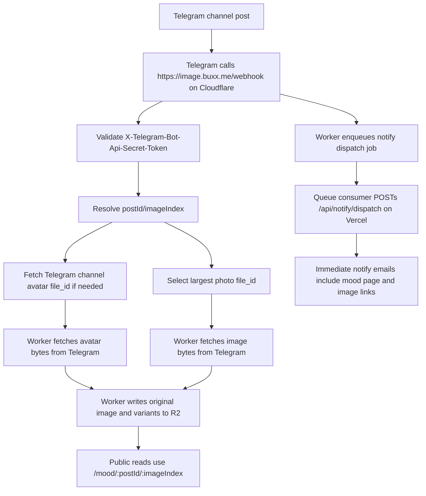

# Telegram Pipeline

This document describes the current Telegram ingestion pipeline for mood posts, HD images, and email notifications.

Current state: March 18, 2026.

## Scope

The Telegram pipeline affects:

- `GET /api/moods`
- `GET /mood/[id]`
- `POST https://image.buxx.me/webhook`
- `POST /api/telegram-webhook`
- `https://image.buxx.me/mood/:postId/:imageIndex`
- `https://image.buxx.me/ingest/...`
- Immediate email notify dispatch triggered by Telegram webhook events

## Current Flow

## Responsibility Split

### Telegram webhook on Cloudflare Worker

Files:

- [`workers/telegram-image-proxy/src/index.ts`](../workers/telegram-image-proxy/src/index.ts)
- [`workers/telegram-image-proxy/wrangler.toml`](../workers/telegram-image-proxy/wrangler.toml)

Responsibilities:

- Validate Telegram webhook secret
- Parse `channel_post`
- Resolve media-group image indexing
- Ingest channel avatar and mood images directly into R2
- Enqueue durable immediate notify dispatch jobs

### Legacy webhook fallback on Vercel

File: [`src/pages/api/telegram-webhook.ts`](../src/pages/api/telegram-webhook.ts)

Responsibilities:

- Remain available as a rollback target
- Preserve the older Vercel-owned webhook path until cleanup is explicitly approved

### Telegram image worker on Cloudflare

Files:

- [`workers/telegram-image-proxy/src/index.ts`](../workers/telegram-image-proxy/src/index.ts)
- [`workers/telegram-image-proxy/wrangler.toml`](../workers/telegram-image-proxy/wrangler.toml)

Responsibilities:

- Receive `POST /webhook` from Telegram
- Authenticate `POST /ingest/*` with `HD_IMAGE_INGEST_TOKEN`
- Resolve Telegram `file_id` to `file_path`
- Download original bytes from Telegram
- Write original plus resized variants into R2
- Consume `telegram-notify-dispatch` queue messages
- Call `POST /api/notify/dispatch` with `NOTIFY_DISPATCH_SECRET`
- Serve `GET /mood/:postId/:imageIndex` and `GET /channel/avatar`

### Mood pages and feed

Files:

- [`src/pages/api/moods.ts`](../src/pages/api/moods.ts)
- [`src/lib/telegram.ts`](../src/lib/telegram.ts)
- [`src/features/mood/shared/utils.ts`](../src/features/mood/shared/utils.ts)

Responsibilities:

- Prefer `PUBLIC_HD_IMAGE_URL` for primary image URLs
- Preserve `/static/...telegram CDN...` as fallback
- Render `data-fallback-src` attributes so the browser can swap to Telegram CDN if HD image lookup fails

### Notify

Files:

- [`src/features/notify/server/service.ts`](../src/features/notify/server/service.ts)
- [`docs/EMAIL-NOTIFY.md`](./EMAIL-NOTIFY.md)

Responsibilities:

- Immediate notify dispatch is triggered by the Worker queue consumer calling `POST /api/notify/dispatch`
- Email templates include related image links extracted from post content
- Notify delivery depends on the Worker queue handoff and `/api/notify/dispatch`, but HD image reads are still separate from email sending

## Key URLs

### Public reads

- `https://image.buxx.me/mood/:postId/:imageIndex`
- `https://image.buxx.me/channel/avatar`

These URLs are embedded into:

- Mood feed payloads from `/api/moods`
- Mood detail page HTML
- Email preview and notify HTML when image links are extracted from post content

### Internal writes

- `https://image.buxx.me/ingest/mood/:postId/:imageIndex`
- `https://image.buxx.me/ingest/channel/avatar`
- `POST https://image.buxx.me/webhook`

These endpoints are intended for Telegram or server-to-server ingestion only.

## Environment Variables

### Vercel

- `PUBLIC_HD_IMAGE_URL`
- `HD_IMAGE_INGEST_BASE_URL`
- `NOTIFY_DISPATCH_SECRET`
- `CRON_SECRET`
- `CLOUDFLARE_ACCOUNT_ID`
- `CLOUDFLARE_API_TOKEN`
- `CLOUDFLARE_NOTIFY_D1_DATABASE_ID`

### Cloudflare worker

- `TELEGRAM_BOT_TOKEN`
- `HD_IMAGE_INGEST_TOKEN`
- `TELEGRAM_WEBHOOK_SECRET`
- `NOTIFY_DISPATCH_SECRET`
- `NOTIFY_DISPATCH_URL`
- `CHANNEL`
- `TELEGRAM_CHANNEL_ID`
- `TELEGRAM_HOST`
- `NOTIFY_DISPATCH_QUEUE` queue binding
- `MOOD_IMAGES` R2 binding

## Failure Modes

### 1. Telegram webhook is not configured

Symptoms:

- New mood posts appear only through public page scraping
- New HD image objects do not show up in R2
- `Ops Health` webhook check fails

Visible impact:

- New images on `image.buxx.me/mood/...` return `404`
- Pages fall back to Telegram CDN
- Newsletter image links may point at `404` HD URLs

### 2. Webhook executes but ingest fails

Symptoms:

- `POST https://image.buxx.me/webhook` returns `200`, but Worker logs contain ingest failures
- Telegram `getWebhookInfo` shows `last_error_message`
- Worker logs contain `Webhook mood image ingest failed`

Visible impact:

- New R2 objects are missing
- `image.buxx.me/mood/...` returns `404`
- Pages fall back to `/static/...`
- Email HTML may still contain HD image URLs that resolve to `404`

### 3. R2 object exists but stale `404` is cached at the edge

Symptoms:

- Backfill verification reports `200`
- Public URL still returns `404` for a short period

Visible impact:

- `Ops Health` may fail temporarily immediately after backfill
- Pages may continue using fallback until cache expires or is purged

### 4. Media-group indexing is wrong

Symptoms:

- A later image in a Telegram album points at the wrong `postId/imageIndex`

Visible impact:

- Wrong image URL in page payload
- Wrong image shown or `404`

### 5. Notify queue handoff fails

Symptoms:

- `POST https://image.buxx.me/webhook` returns `503`
- Worker logs contain `Failed to enqueue notify dispatch`
- Telegram retries the same webhook delivery

Visible impact:

- Immediate notify is delayed until queue persistence succeeds
- Image ingest may already have completed even though Telegram will retry

## Current Operational Safeguards

- Browser fallback from HD image to Telegram CDN on page render
- `Ops Health` GitHub Actions workflow checks:
  - Telegram webhook registration
  - Readability of recent HD image URLs
- Cloudflare custom rule allowing `POST /ingest/*` on `image.buxx.me`
- `workers_dev = true` enabled on the image worker for additional debugging paths

## Known Coupling

Current coupling that still matters:

- Telegram webhook still triggers image ingest before the request returns
- Immediate notify still depends on a Worker-to-Vercel handoff, but that handoff is now queue-backed instead of best-effort
- Public mood pages can still fall back to Telegram CDN, but email links cannot auto-fallback after delivery
