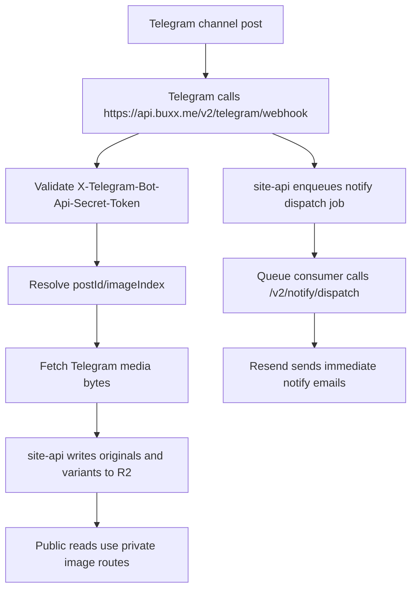

# Telegram Pipeline

This document describes the private Telegram ingestion pipeline for mood posts, HD images, and email notifications.

## Scope

The Telegram pipeline affects:

- `POST https://api.buxx.me/v2/telegram/webhook`
- `https://api.buxx.me/v2/images/*`
- immediate email notify dispatch
- public mood pages that still consume Telegram content during this migration wave

## Current Flow

## Responsibility Split

### `site-api`

Responsibilities:

- validate Telegram webhook secrets
- parse `channel_post`
- resolve media-group image indexing
- ingest mood images into R2
- enqueue durable immediate notify dispatch jobs
- dispatch notification email through `/v2/notify/dispatch`

### Public `site`

Responsibilities during this migration wave:

- render mood feed and detail pages
- keep `/api/moods` and `/api/comments` public until the mood API wave lands
- use `PUBLIC_HD_IMAGE_URL` for primary image URLs
- preserve `/static/...telegram CDN...` fallback behavior

## Key URLs

Canonical private URLs:

- `https://api.buxx.me/v2/telegram/webhook`
- `https://api.buxx.me/v2/images/*`
- `https://api.buxx.me/v2/notify/dispatch`

Public compatibility:

- `https://buxx.me/api/notify/*` proxies to `site-api`

## Failure Modes

**Webhook not configured.** New posts do not enter private ingest, R2 objects do not update, and immediate notification dispatch does not run.

**Image ingest fails.** Public mood pages can use stored Telegram CDN fallbacks when `site-api` returns them, but email links cannot auto-fallback after delivery.

**Notify queue handoff fails.** The webhook should return a retryable failure so Telegram can redeliver the update.
