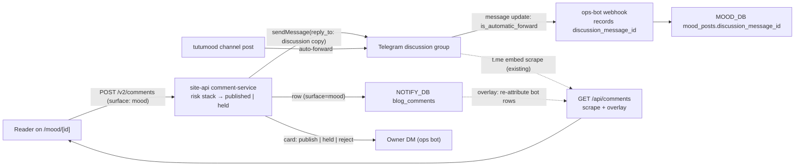

# Executive Plan: Mood Comments Bridge (web → Telegram discussion group)

Written 2026-09-06 from an owner request: give `/mood/[id]` a real compose
box, and have every comment written on the site land in the Telegram
discussion group behind the `tutumood` channel, posted by the management bot.
Reference the owner pointed at: [aozorae/Edgechat](https://github.com/aozorae/Edgechat),
a Workers-based team chat whose distinctive feature is a bot that mirrors a
web group into a Telegram group in both directions.

This is a plan, not an implementation. Code lands in `site-api` (write path,
bot, bridge) and here (UI, contracts, docs).

## Objective

A reader on `/mood/[id]` types a comment and presses Post. Within a few
seconds the comment is visible on the page and in the channel's Telegram
comment thread, attributed to the reader's chosen name. Telegram users keep
replying in the group exactly as today, and the web page keeps showing the
whole thread. Moderation stays in the owner's hands through the ops bot, with
the same cards the blog already uses.

## What already exists

The two halves of this feature are both built; they have never been wired
together.

| Piece | Where | State |
| --- | --- | --- |
| Mood comment **read** path | `site-api` `telegram-fallback-repository.ts` `listComments` → scrapes `t.me/<channel>/<id>?embed=1&discussion=1`, sanitizes, returns `MoodCommentsPage`; served at `GET /api/comments?postId=` and `/v2/mood/:id/comments`, edge-cached | Shipped, live-only by owner decision (`site-api` commit `7f8c25b`, plan `mood-hybrid-read.md` non-goals: "comments are not archived") |
| Mood comment **UI** | `src/features/mood/ui/CommentsSection.astro` + `client/detail-comments-controller.ts` (detail thread) and `client/feed-comments-popover.ts` (feed hover preview) | Shipped, read-only; the last row is a "Leave a comment → Telegram" CTA |
| Comment **write** path with the full risk stack | `site-api` `src/features/comments/server/*`: Turnstile, honeypot, dwell token, heuristics, `RateLimitDO`, Akismet, shadow-ban, held→approve, owner Telegram cards, 15-min edit, delete, reader identity L0/L1/L2 | Shipped for `/blog/[slug]`, keyed on Ghost `post.id` via `post-registry.ts` |
| Owner → Telegram → site reply | `site-api` `comments/server/telegram-reply.ts` + `ops-bot/webhook.ts`: the owner taps Reply on a card, types in the ops-bot DM, the text is published as a comment with `session_id = telegram:<userId>` | Shipped |
| Channel ingest bot | `site-api` `mood/ingest/telegram-webhook.ts` on `TELEGRAM_BOT_TOKEN`; receives `channel_post`, `edited_channel_post`, reactions | Shipped; knows nothing about the linked group |
| Ops bot | `site-api` `ops-bot/*` on `TELEGRAM_OPS_BOT_TOKEN`; owner-only DM, allowlisted user ids, pending-action tokens | Shipped |

So the work is a bridge, not a comment system.

## The one decision that shapes everything: thin bridge, not a mirror

Edgechat mirrors both directions into its own database and serves the thread
from there. Two designs were weighed against it:

**A. Thin bridge (chosen).** The Telegram group stays the single source of
truth for the thread. The site stores only the comments *it* originated
(needed anyway for moderation, ownership, edit and delete). Web → Telegram
is the bot posting into the thread. Telegram → web stays the existing live
read, plus a small overlay that re-attributes the bot's messages to the
reader who wrote them.

**B. Mirror.** Put the bot in the group as an admin, ingest every group
message into D1, serve the thread from D1, bridge web comments out.

B was rejected, and not narrowly:

- It reverses an explicit owner decision ("comments are not archived",
  `7f8c25b`) for a benefit this feature does not need.
- Telegram sends no update when a group message is deleted. A mirror needs a
  reconcile loop (scrape-and-diff) just to keep deleted comments off the
  site. In A, deleting in Telegram is the moderation action, and the web
  follows for free on the next read.
- A mirror needs backfill of years of history the Bot API cannot read,
  avatar ingestion (`getUserProfilePhotos` → R2), and rich-content rendering
  for stickers, photos, and custom emoji. The scrape already does all of
  that.
- Real-time on a comment thread is a scrape TTL problem, not a WebSocket
  problem. Edgechat's Durable Object fan-out is right for a chat app and
  wrong here.

A keeps every open question small enough to answer in one sentence. The
ingest that B needs is additive; if the scrape ever becomes untenable, A's
bot is already in the group and B becomes a follow-up, not a rewrite.

## Design

### Topology



### Which bot

The **ops bot** (`TELEGRAM_OPS_BOT_TOKEN`) does the bridging. It already owns
comment moderation (cards, approve/hide/delete/reply, pending actions), so
"a comment reached Telegram" and "the owner acted on a comment" stay one
code path. It joins the discussion group as an administrator with
*Delete messages* (so it can retract a comment the owner hides or deletes)
and no other rights.

The channel ingest bot stays untouched. Splitting the two keeps the ingest
webhook's threat surface where it is (channel posts only) and lets the ops
bot's user allowlist keep protecting its command surface: the group branch
below handles exactly one update shape and ignores everything else before
the allowlist runs.

Readers in Telegram will see the comments arrive under the bot's display
name. Rename the bot in BotFather to something that reads as the site
("buxx.me") rather than as ops tooling; see open decision 1.

### Thread mapping: `discussion_message_id`

Telegram auto-forwards every channel post into the linked group. The copy
has its own `message_id` in the group, and comments are replies to *that*
message. To post a web comment into the right thread the bot must reply to
the copy, so the site needs `channel message_id → group message_id`.

- The ops bot's webhook gains one branch: a `message` update whose
  `chat.id` equals `TELEGRAM_DISCUSSION_CHAT_ID` and whose
  `is_automatic_forward` is true, with `forward_origin.chat.id` equal to
  the channel and `forward_origin.message_id` set. It writes
  `mood_posts.discussion_message_id = message.message_id` for that channel
  post. Everything else from the group is dropped without a reply.
- `allowed_updates` for the ops bot grows by `message` (it already receives
  `message` for DM commands; the new part is *group* messages, which requires
  the bot to be an admin or to have privacy mode off — admin is required
  for deletion anyway).
- Posts that predate the bot joining have no mapping. Phase 0 checks
  whether the embed discussion page exposes the thread root's group id; if
  it does, a one-off backfill fills the column from the scrape. If it does
  not, the compose box stays hidden on those posts and the existing
  "Leave a comment → Telegram" CTA remains. The mapping fills forward from
  the day the bot joins.

One nullable column, one webhook branch. No mapping table.

### Write path: web → group

`POST /v2/comments` accepts `surface: 'mood'` (default `'blog'`, so nothing
about the blog changes). `resolveCommentablePost` becomes a two-arm
function:

- `blog` → the existing Ghost registry.
- `mood` → `MOOD_DB`: the post must exist, not be soft-deleted, and have a
  `discussion_message_id`. Title for the owner card is the first ~60 chars
  of the post text; the public URL is `/mood/<id>#comment-<commentId>`.

The risk stack runs unchanged: Turnstile (`expectedAction:
'mood_comment_create'`, a separate action so the two surfaces can be tuned
apart), honeypot, dwell, heuristics, durable rate limits (shared counters
with the blog, on purpose: one person, one budget), Akismet with
`permalink` set to the mood URL, shadow-ban. Verdict mapping is identical.

Then the bridge, as a side effect in `side-effects.ts` next to the owner
card:

- **`published`** → `sendMessage` to the group with
  `reply_parameters.message_id = discussion_message_id` (or the parent
  comment's `telegram_message_id` when replying to a bridged comment), HTML
  parse mode:

  ```
  <b>{displayName}</b> <a href="{commentUrl}">via buxx.me</a>
  
  {body as Telegram HTML}
  ```

  On success, write `telegram_chat_id`, `telegram_message_id`,
  `telegram_synced_at` on the row. On failure, log and leave
  `telegram_message_id` NULL; the hourly cron's existing sweep pattern
  retries rows where `status='published' AND surface='mood' AND
  telegram_message_id IS NULL AND created_at > now-24h`. The retry claims
  the row first (`telegram_bridge_attempted_at`) so a slow first attempt
  and a retry cannot both send.
- **`held`** → nothing reaches Telegram. Approve (card or portal) runs the
  same bridge step. This is the point of holding.
- **`reject`** → nothing, ever.

The body is plain text plus the small comment Markdown the blog already
accepts; `comment-markdown.ts` gains a `toTelegramHtml` renderer (bold,
italic, code, links; everything else falls back to text). The bot never
sends a reader's email, session, or IP anywhere.

Owner replies typed into the ops-bot DM (`publishTelegramCommentReply`) go
through the same bridge, so an owner reply written from the phone shows up
in the group thread too. Owner replies typed directly in the group need no
code: they are ordinary Telegram comments and reach the web through the
read path.

### Edit and delete

- **Edit** (15-min window, verified readers only, unchanged rule) →
  `editMessageText` on the bridged message. Telegram shows "edited"; the
  web row shows `editedAt` as today.
- **Delete by reader**, **hide**, **delete by owner** → `deleteMessage` in
  the group, then the existing row transition. A failed delete is logged
  and the row still transitions: the site never shows something the owner
  removed because Telegram was slow. The cron retries `telegram_message_id
  IS NOT NULL AND status IN ('deleted','rejected') AND
  telegram_synced_at < updated_at`.
- **Delete in Telegram** (owner or a group admin removes the bot's message)
  → the scrape stops returning it, the overlay finds no match and does
  **not** resurrect it: a bridged row whose `telegram_message_id` is set
  but absent from the scraped page is treated as removed and skipped. The
  row itself is left alone (it is the owner's moderation record), but it
  gets `status='deleted'` lazily by the same cron, so the reader's "my
  comments" list agrees with the group.

### Read path: scrape plus overlay

`listComments(postId)` keeps scraping. Before returning a page it loads the
site-originated rows for the post (`surface='mood' AND post_id=? AND
status='published'`, one indexed query) and applies an overlay:

1. A scraped comment whose id equals a row's `telegram_message_id` is the
   bot's copy. Replace `author` with the row's `display_name`,
   `authorAvatar` with the reader's proxied avatar, `content` with the row's
   rendered body, and mark `origin: 'web'`. Reactions stay from the scrape
   (Telegram users reacted to it there).
2. A row with `telegram_message_id` set that is *not* on the page: if its
   `created_at` falls inside the page's time range, it was removed in
   Telegram — skip (see Edit and delete). If it is newer than the newest
   scraped comment, the scrape is stale — append it as a synthesized
   comment so the writer sees their own comment immediately on reload
   instead of after the edge TTL.
3. A row with `telegram_message_id` NULL (bridge pending or failed) is
   appended the same way: the site is not held hostage to a Telegram
   hiccup.
4. Scraped replies that quote the bot's message (`mood-comment-quote`)
   get the same author substitution so the quote reads "Alice" not
   "buxx.me bot".

This assumes scraped comment ids are the group message ids (they are the
`?comment=<id>` deep-link ids). Phase 0 verifies it against one real
bridged message before anything else is built; if it is false the overlay
keys on `(bot author name, exact body)` instead, which is uglier but
sufficient because the bot's text is deterministic.

Held rows are never in this response: the read path is public and
edge-cached. The writer learns "held for review" from the POST response and
a one-line note under the compose box, exactly as on the blog.

### Reader identity, privacy, disclosure

Same `reader_anon` cookie, same reader table, same three grades. A reader
who verified on the blog is verified on mood; the "my comments" list on
`/subscribe/manage` shows both surfaces with a small label.

What changes is publication scope, and it must be said out loud: a web
comment is republished into a public Telegram group under the display name
the reader typed. The compose box carries one permanent line: "Posted here
and in the Telegram discussion group." The privacy policy gains a sentence
naming Telegram as a recipient of display name and comment text for mood
comments. Email, session, IP, and every risk signal stay on the server as
today.

Telegram users' names and avatars already appear on the site through the
scrape; nothing new there.

### Frontend

`/mood/[id]` (`DetailArticle.astro` → `CommentsSection.astro`):

- The mood document gains `discussionLinked: boolean` (server-derived from
  `discussion_message_id IS NOT NULL`). When true, the CTA row is replaced
  by a compose box; when false, the CTA stays as today.
- The compose box is a new compact component in the mood zone
  (`src/features/mood/ui/CommentCompose.astro`) reusing the blog's
  client modules verbatim: `turnstile-token.ts`, `drafts.ts`,
  `identity.ts`, `compose-validate.ts`, `comment-markdown.ts`,
  `reader-avatar.ts`. One name field, one optional email field, one
  textarea, Post. No reaction bar, no threading UI: the mood thread is
  flat and chronological like Telegram's, and replies render as the
  existing quote card. Reply-to is a small "Reply" affordance on each
  comment that sets `parentId` and shows a quote chip above the textarea.
- On success the controller inserts the returned comment into
  `[data-comments-list]` optimistically, tagged `origin: 'web'` and
  `mine`, and bumps `[data-comments-count]`. On `held` it shows the
  note and does not insert.
- The feed hover popover (`feed-comments-popover.ts`) needs no change: it
  reads the same overlaid endpoint.
- Live-ness: the detail page re-fetches the thread when the tab regains
  focus and every 45 s while visible, patching by id (same pattern as the
  feed update watcher). No Durable Object, no WebSocket.

Copy lives in `src/features/comments/copy.ts` beside the blog strings so
tone stays one voice.

### Ops bot surface

No new commands. The existing `/comments` queue and the four card actions
cover mood rows because they are the same table. Two touches:

- Cards say which surface: "💬 New comment published · mood".
- The *View* button deep-links to `/mood/<id>#comment-<id>`.

The group-message branch in the webhook is the only new update handling,
and it writes one column.

## Data model

`NOTIFY_DB`, migration `0022_comment_surfaces.sql` in `site-api`. The table
keeps its name; renaming a live table buys nothing (same call as
`notify_subscribers` in `0016`).

```sql
ALTER TABLE blog_comments ADD COLUMN surface TEXT NOT NULL DEFAULT 'blog'
  CHECK (surface IN ('blog', 'mood'));
ALTER TABLE blog_comments ADD COLUMN telegram_chat_id TEXT;
ALTER TABLE blog_comments ADD COLUMN telegram_message_id INTEGER;
ALTER TABLE blog_comments ADD COLUMN telegram_synced_at TEXT;
ALTER TABLE blog_comments ADD COLUMN telegram_bridge_attempted_at TEXT;

-- The public feed index now leads with surface; Ghost ids and Telegram
-- message ids never collide, but every query names the surface anyway.
DROP INDEX IF EXISTS idx_blog_comments_public_feed;
CREATE INDEX idx_blog_comments_public_feed
  ON blog_comments(surface, post_id, created_at) WHERE status = 'published';

CREATE UNIQUE INDEX idx_blog_comments_telegram_message
  ON blog_comments(telegram_chat_id, telegram_message_id)
  WHERE telegram_message_id IS NOT NULL;

CREATE INDEX idx_blog_comments_bridge_pending
  ON blog_comments(surface, created_at)
  WHERE surface = 'mood' AND telegram_message_id IS NULL AND status = 'published';
```

`post_id` for a mood row is the channel message id as a string, the same
value `/mood/[id]` uses. `parent_id` keeps its one-level-threading rule.

`MOOD_DB`, migration `0012_mood_discussion_link.sql`:

```sql
ALTER TABLE mood_posts ADD COLUMN discussion_message_id INTEGER;
```

No other schema changes. No new tables.

## Contracts (`packages/contracts`, canonical here, synced to site-api)

- `comments.ts`: `COMMENT_SURFACES = ['blog', 'mood']`, `CommentSurface`;
  `CommentCreateInput.surface?: CommentSurface`; `Comment.surface`;
  `Comment.telegramMessageId: number | null` (owner/admin views only, never
  the public list).
- `mood.ts`: `MoodComment.origin?: 'telegram' | 'web'`;
  `MoodComment.commentId?: string` (the site row id when `origin === 'web'`,
  so the client can mark `mine` and anchor `#comment-<id>`);
  `MoodContentDocument.discussionLinked?: boolean`.
- `telegram-ops.ts`: `TELEGRAM_OPS_ALLOWED_UPDATES` unchanged in kind
  (`message` is already there); document that group messages are now
  expected.

## Configuration and one-time setup

| Item | Where | Value |
| --- | --- | --- |
| `TELEGRAM_DISCUSSION_CHAT_ID` | site-api var | From `getChat(@tutumood).linked_chat_id`; a `scripts/print-discussion-chat.ts` one-liner prints it |
| Bot membership | Telegram | Add the ops bot to the discussion group as admin with *Delete messages* only |
| Bot display name | BotFather | See open decision 1 |
| `MOOD_COMMENTS_ENABLED` | site-api var | Kill switch: `false` hides the compose box (`discussionLinked` forced false) and rejects `surface: 'mood'` creates with 404; reads keep working |
| Turnstile action | Cloudflare dashboard | `mood_comment_create` allowed on the widget |
| `check-production-readiness.ts` | site-api | Adds `TELEGRAM_DISCUSSION_CHAT_ID` to the required set when `MOOD_COMMENTS_ENABLED=true` |
| Docs | this repo | `docs/api/comments.md` (surface param, bridge semantics), `docs/api/content.md#comments-by-post-id` (`origin`, overlay), `docs/platform/telegram.md` (second diagram: the bridge), `docs/platform/comments.md`, privacy policy |

## Failure modes

| What breaks | What the reader sees | What the owner sees |
| --- | --- | --- |
| Telegram API down at post time | Comment published on site immediately (overlay rule 3); reaches the group on the next hourly retry | Card arrives as usual; `/comments` shows a "bridge pending" count |
| Bot removed from the group / lost admin | Same as above, permanently pending | Readiness check and the hourly cron log `bridge_forbidden`; the fix is re-adding the bot |
| `discussion_message_id` missing for a post | No compose box; Telegram CTA as today | Nothing; expected for pre-bridge posts |
| Scrape down (t.me embed blocked) | Existing behaviour: comments section shows the empty/error state. Site-originated rows are still appended (rule 3 degrades to "web comments only") | Nothing new |
| Owner deletes the bot's message in Telegram | Comment disappears on next read; row flips to `deleted` within the hour | Nothing; that was the intent |
| Duplicate send (retry after a timed-out success) | Two identical bot messages in the group; the overlay maps the recorded one and shows the other as a plain bot message | Delete the stray by hand; the claim column makes this rare, not impossible |

## Phases

0. **Spike (half a day, no code merged).** Add the ops bot to the group,
   set `TELEGRAM_DISCUSSION_CHAT_ID`, `curl` a `sendMessage` reply into one
   thread by hand, then fetch `t.me/tutumood/<id>?embed=1&discussion=1` and
   confirm (a) the bot's message appears, (b) its `data-post` comment id
   equals the Bot API `message_id`, (c) whether the embed exposes the thread
   root's group id for backfill. Everything below assumes (a) and (b); (c)
   only decides whether old posts get the compose box.
1. **Mapping.** Migration `0012`, the webhook branch, readiness check.
   Deploy, post one channel message, watch the column fill.
2. **Write path + bridge.** Migration `0022`, `surface` on
   `/v2/comments`, mood arm of `resolveCommentablePost`, `sendMessage`
   bridge, edit/delete propagation, cron retry, card tweaks, contracts,
   docs. Ship behind `MOOD_COMMENTS_ENABLED=false`.
3. **Read overlay.** `listComments` overlay rules 1–4, `origin` on the wire,
   unit tests with a recorded embed page containing a bridged message.
4. **UI.** `discussionLinked`, `CommentCompose.astro`, controller,
   optimistic insert, focus re-fetch, copy, privacy policy. Flip
   `MOOD_COMMENTS_ENABLED=true`. E2E: post → row → bot message → overlay,
   on staging with `AKISMET_TEST_MODE=1`.
5. **Backfill (conditional on 0c).** Fill `discussion_message_id` for
   historical posts from the scrape.

Phases 1–3 are pure site-api and invisible to readers. Phase 4 is the only
one a reader can notice.

## Decisions taken

1. **Thin bridge, Telegram is the source of truth.** Reasoned above; also
   keeps the "comments are not archived" decision intact.
2. **Ops bot does the bridging**, not the channel ingest bot and not a
   third bot. One bot owns "comments in Telegram".
3. **Reuse `blog_comments` with a `surface` column** instead of a mood
   table. One moderation queue, one card set, one ownership model, one
   reader identity. The table name is now wrong and stays wrong on purpose.
4. **Held comments never reach Telegram.** Approving is what publishes them
   there. The group is public; the queue exists so that not everything is.
5. **Site publishes even when Telegram fails.** Overlay rule 3. The group
   is the source of truth for the thread, but the site is the source of
   truth for the site's own writers' intent.
6. **Deletion in Telegram wins.** No resurrection, no reconcile loop; the
   scrape's absence is the signal.
7. **No real-time transport.** Focus re-fetch plus a 45 s visible-tab poll.
8. **Flat thread, one-level replies, quote cards.** Matches Telegram's own
   rendering and the existing mood UI; the blog's nested layout does not
   move over.
9. **Shared rate-limit counters across surfaces.** One person, one budget.
10. **Bridge message format is fixed**: bold name, "via buxx.me" link,
    blank line, body. Readers in Telegram can tell at a glance which
    comments came from the site and can click through.

## Open decisions (owner)

1. **Bot display name in the group.** The ops bot's current name is ops
   tooling. Options: rename it to read as the site ("buxx.me"), or register
   a dedicated bridge bot (one more token, one more allowlist, cleaner
   identity). Recommendation: rename; a third bot is config for the sake
   of a label.
2. **Anonymous compose on mood.** Blog allows email-less posting (the
   second-click confirmation). Mood inherits that by default. Keep, or
   require an email on mood because the words are republished to a public
   group? Recommendation: keep parity; the display name is what gets
   republished either way, and a required email manufactures fakes
   (`notes/comments-akismet-optional-email.md`).
3. **Reply-to in the compose box** (phase 4 scope). Replying to a specific
   comment threads correctly in Telegram (`reply_parameters` to the bot's
   copy) only when the target is a bridged web comment; replying to a
   Telegram-origin comment needs its group message id, which the scrape
   gives (same id assumption as the overlay). Ship reply-to in phase 4, or
   root-only first? Recommendation: ship it; it is the same id and the
   quote card already exists.
4. **Telegram-origin reactions on bridged comments** stay from the scrape
   (rule 1). Should the site's heart (`blog_reactions`) also exist on mood
   comments? Recommendation: no; two reaction systems on one row is a
   mess, and Telegram's is the one the group sees.

## Non-goals

- Ingesting Telegram-origin comments into D1 (the mirror). Additive later
  if the scrape dies; not now.
- Reactions from the web on mood comments.
- Rich media in web comments (photos, stickers). Text and small Markdown.
- Notifying Telegram users about web replies beyond what Telegram itself
  does when the bot replies to their message (which is already a
  notification).
- Replacing the scrape. Plan `mood-hybrid-read.md` phase 2 still owns that
  question.

## Dependencies

- `site-api`: comments feature (shipped), ops bot (shipped), `RateLimitDO`,
  hourly cron, `MOOD_DB` and `NOTIFY_DB` bindings on the same Worker.
- This repo: `@bunizao/contracts` change first, then `bun run
  sync:contracts` in `site-api`; `bun run check:docs-coverage` after the
  new `surface` parameter is documented (no new routes, so it should pass
  as-is).
- Telegram: the ops bot as admin in the linked group; `linked_chat_id`
  readable via `getChat`.
