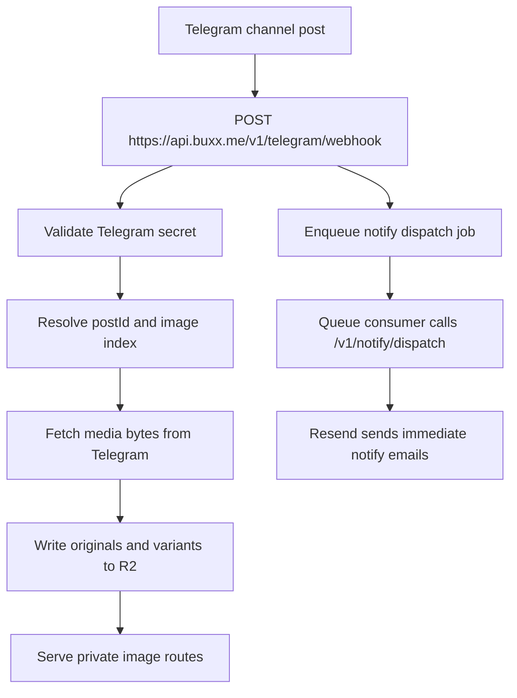

Telegram ingestion now belongs to the private `site-api` Worker.

## Current flow

## Responsibility split

`site-api` owns:

- Telegram webhook validation
- media-group image indexing
- mood image ingest into R2
- queueing immediate notify dispatch
- scheduled notify and retry work

The public `site` Worker still owns, during this migration wave:

- `/api/moods`
- `/api/comments`
- `/mood`
- `/mood/[id]`
- Telegram CDN fallback behavior through `/static/...`

## Key URLs

Canonical private URLs:

- `https://api.buxx.me/v1/telegram/webhook`
- `https://api.buxx.me/v1/images/*`
- `https://api.buxx.me/v1/notify/dispatch`

Public compatibility:

- `https://buxx.me/api/notify/*`

## Failure modes

**Webhook not configured.** New posts do not enter private ingest, R2 objects do not update, and immediate notification dispatch does not run.

**Image ingest fails.** Public mood pages can still fall back to Telegram CDN while the current public scraper exists. Email links cannot auto-fallback after delivery.

**Notify queue handoff fails.** The webhook should return a retryable failure so Telegram can redeliver the update.
