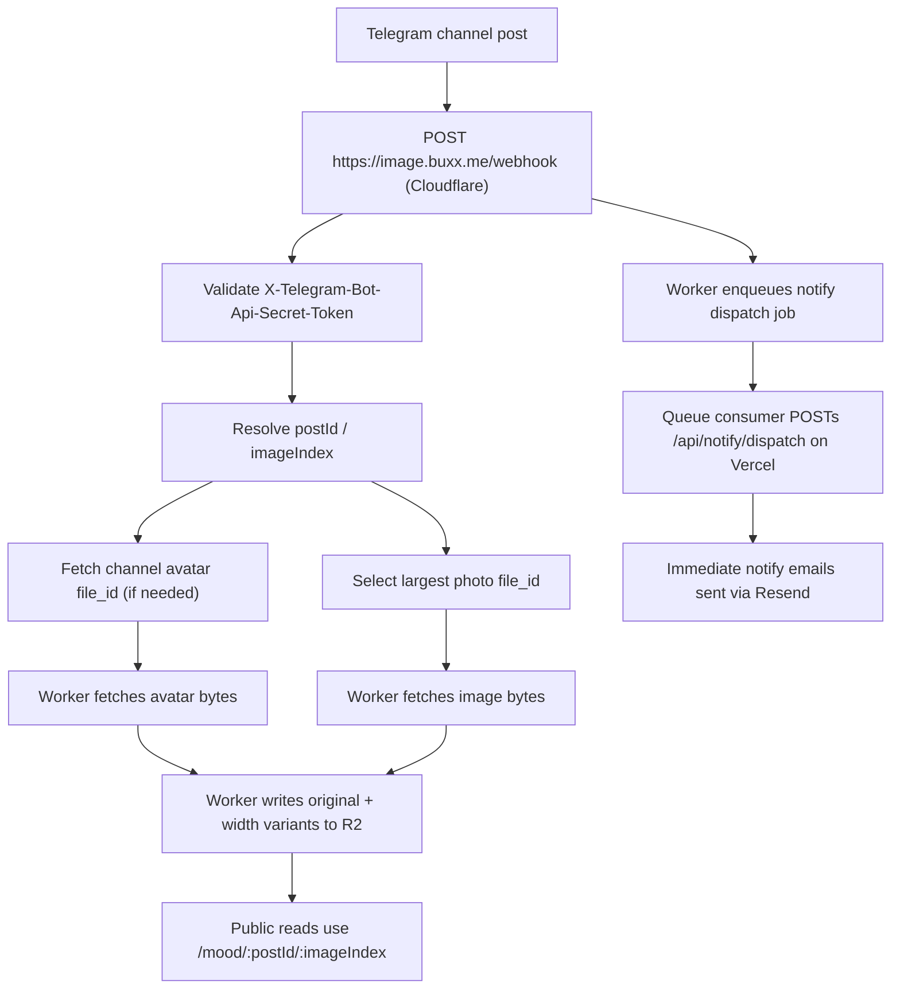

The Telegram pipeline turns a channel post into three things: a card in the public mood feed, an HD image stored in R2, and an email to subscribers. Two services own different parts: the Cloudflare image worker and the Astro/Vercel app.

## The flow

## Who owns what

**Cloudflare image worker** (`workers/telegram-image-proxy/`) owns webhook validation, media-group indexing, image ingest into R2, and queueing immediate notify jobs. It serves public reads at `https://image.buxx.me/mood/:postId/:imageIndex` and `/channel/avatar`, and authenticated writes at `/ingest/...` (gated by `HD_IMAGE_INGEST_TOKEN`).

**Astro/Vercel app** owns Telegram content scraping, public mood pages, subscriber state, email delivery via Resend, idempotency, and retry logic. The site never reads bytes from Telegram for images — that's the worker's job. It does still scrape Telegram for post bodies; the worker doesn't provide canonical text.

A legacy webhook lives at `/api/telegram-webhook` as a rollback target. It's not the preferred production path.

## Public URLs

Reads go through:

- `https://image.buxx.me/mood/:postId/:imageIndex` — closest pre-generated width variant, cached at the edge.
- `https://image.buxx.me/channel/avatar` — channel avatar.

These are embedded in feed payloads, mood detail HTML, and email image links. Page render falls back to `/static/...` (Telegram CDN through the site proxy) when an HD URL returns 404.

## Environment

Vercel:
- `PUBLIC_HD_IMAGE_URL`, `HD_IMAGE_INGEST_BASE_URL`
- `NOTIFY_DISPATCH_SECRET`, `CRON_SECRET`
- `CLOUDFLARE_ACCOUNT_ID`, `CLOUDFLARE_API_TOKEN`, `CLOUDFLARE_NOTIFY_D1_DATABASE_ID`

Cloudflare worker:
- `TELEGRAM_BOT_TOKEN`, `HD_IMAGE_INGEST_TOKEN`, `TELEGRAM_WEBHOOK_SECRET`
- `NOTIFY_DISPATCH_SECRET`, `NOTIFY_DISPATCH_URL`
- `CHANNEL`, `TELEGRAM_CHANNEL_ID`, `TELEGRAM_HOST`
- `MOOD_IMAGES` R2 binding, `NOTIFY_DISPATCH_QUEUE` queue binding.

## Failure modes

**Webhook not configured.** New posts only show up via public-page scraping. New R2 objects don't appear; `image.buxx.me/mood/...` returns 404; pages fall back to Telegram CDN; newsletter image links may resolve to 404. The Ops Health workflow catches this.

**Webhook executes but ingest fails.** `POST /webhook` returns 200, but the worker logs `Webhook mood image ingest failed`. Telegram's `getWebhookInfo` shows `last_error_message`. New R2 objects are missing; pages fall back to `/static/...`; email HTML may still reference broken HD URLs.

**Stale 404 cached at the edge.** A backfill writes to R2 and verifies 200, but the public URL still returns 404 for a short window. Ops Health may flap until cache expires or is purged.

**Wrong media-group indexing.** A later image in an album points at the wrong `postId/imageIndex`. The wrong image (or a 404) shows up in the page payload.

**Notify queue handoff fails.** `POST /webhook` returns 503 with `Failed to enqueue notify dispatch`. Telegram retries the same delivery. Image ingest may already have completed even though the retry is incoming. Immediate notify is delayed until queue persistence succeeds.

## Safeguards

- Browser-side fallback from HD image to Telegram CDN.
- Ops Health GitHub Actions checks Telegram webhook registration and recent HD image readability.
- Cloudflare custom rule allowing `POST /ingest/*` on `image.buxx.me`.
- `workers_dev = true` on the image worker for debugging.

## Coupling that still matters

The webhook still triggers image ingest before returning. Immediate notify still depends on the worker → Vercel handoff (now queue-backed). Public mood pages can fall back to Telegram CDN, but email links cannot auto-fallback after delivery — once the email is out, broken HD URLs stay broken.
