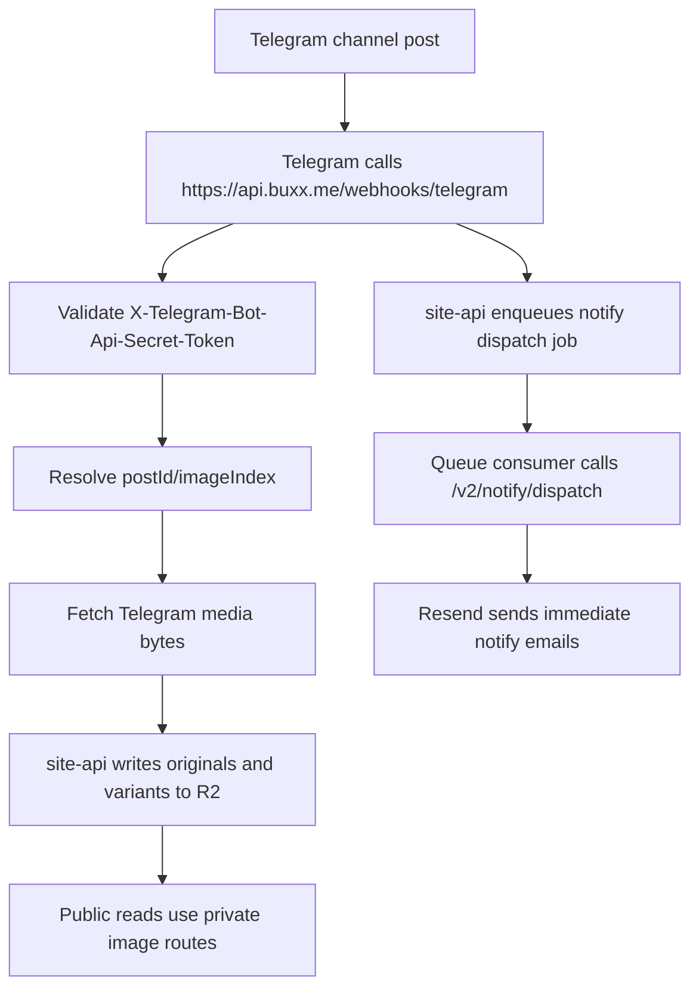
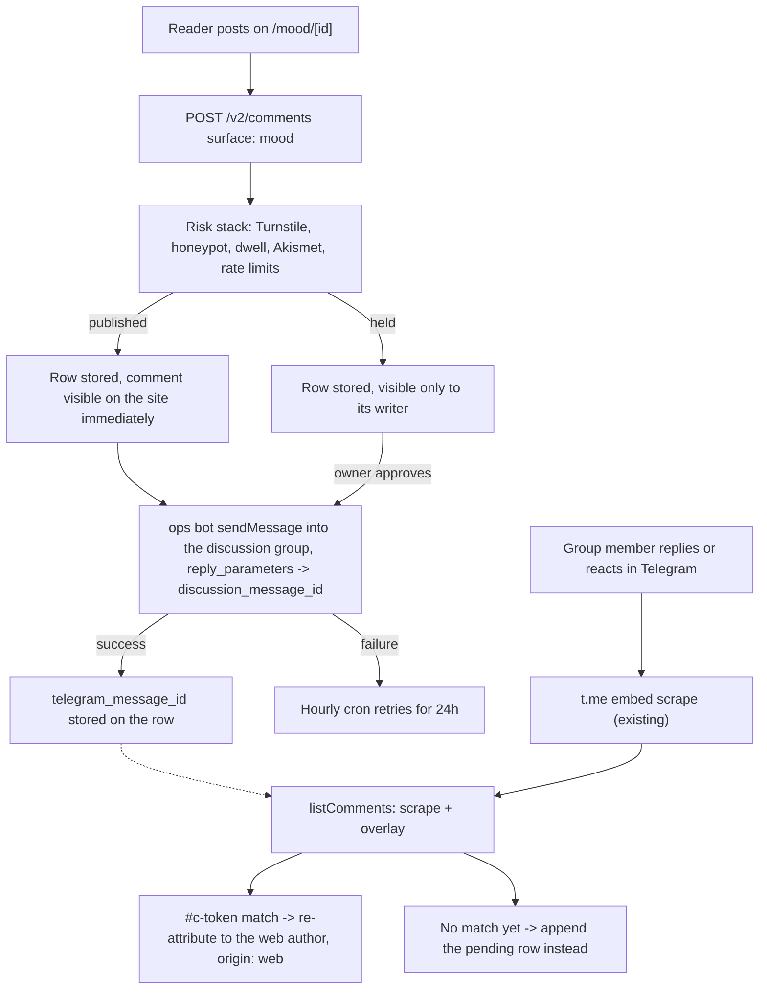

This document describes the private Telegram ingestion pipeline for mood posts, HD images, and email notifications.

## Scope

The Telegram pipeline affects:

- `POST https://api.buxx.me/webhooks/telegram`
- `https://buxx.me/api/v2/images/*`
- immediate email notify dispatch
- public mood pages that still consume Telegram content during this migration wave

## Two bots, one owner channel

- **Ingest bot** (`TELEGRAM_BOT_TOKEN`) reads the channel: webhook updates, media files, chat info. It never messages the owner.
- **Ops bot** (`TELEGRAM_OPS_BOT_TOKEN`) is the only bot that talks to the owner. Every unsolicited notification — comments, lockdowns, messages, notify gate, subscribe and unsubscribe notices, newsletter holds, ops alerts — goes through `sendOwnerAlert` in `site-api` to each id in `TELEGRAM_OPS_ALLOWED_USER_IDS`. It also mirrors web comments into the discussion group and answers commands.

## Current flow

## The comment bridge

A second, independent flow shares the same ops bot: a web reader's mood
comment, bridged into the post's Telegram discussion group, and the read
path that overlays the group's own scrape with the site's copy of what it
sent. Gated by `MOOD_COMMENTS_ENABLED` — see
[Comments platform](/docs/platform/comments) for the kill switch and the
Phase 0 setup — and detailed end to end in
[Comments API § Mood surface](/docs/api/comments#mood-surface-the-telegram-bridge).

### How a post finds its thread

`discussion_message_id` is written by the ops bot when Telegram copies a
channel post into the linked group (`is_automatic_forward`). Normally that
copy's `forward_origin` names the channel and the post's own id, and the
mapping is exact.

A post that was *itself* a forward is the exception. Telegram flattens
forward chains, so the group copy's `forward_origin` describes the original
author — another channel, using its own message numbering, or a plain user,
which carries no message id at all. MTProto keeps the immediate source in
`saved_from_msg_id`; the Bot API does not expose it, so there is nothing in
the copy that names our post. The bot therefore only trusts the origin's id
when the origin chat is our own channel, and otherwise matches the newest
still-unlinked post published within two minutes of the copy. An origin
match overwrites whatever the column held; a date match only ever fills a
blank.

Posts forwarded before this landed (mood 3823, 3873) have no thread and
render the "Leave a comment on Telegram" link instead of the compose box.

## Who does what

| `site-api` (private) | Public `site` |
| --- | --- |
| Validate the Telegram webhook secret | Render mood feed and detail pages |
| Parse `channel_post` and resolve media-group image indexing | Consume `/api/moods` and `/api/comments` |
| Ingest mood images into R2 | Use `PUBLIC_HD_IMAGE_URL` for primary image URLs |
| Enqueue durable immediate notify dispatch jobs | Preserve the `/static/…` Telegram CDN fallback |
| Dispatch notification email through `/v2/notify/dispatch` | — |
| Run the risk stack, bridge `published` mood comments (and `held` ones once approved) into the discussion group, overlay the scrape on read | Render the mood compose box only when `discussionLinked`, POST `/v2/comments` with `surface: 'mood'` |

## Key URLs

| URL | Role |
| --- | --- |
| `https://api.buxx.me/webhooks/telegram` | Webhook ingress. Private. |
| `https://buxx.me/api/v2/images/*` | Public image reads, served from R2 |
| `https://api.buxx.me/v2/notify/dispatch` | Queue consumer target for immediate notify |
| `https://buxx.me/api/*` | Routed directly to `site-api` in production |

## Failure modes

| What breaks | What happens |
| --- | --- |
| Webhook not configured | New posts never enter private ingest: R2 objects do not update and immediate notification dispatch never runs. |
| Image ingest fails | Public mood pages fall back to the stored Telegram CDN URLs when `site-api` returns them. **Email cannot fall back** — a link is fixed at delivery. |
| Notify queue handoff fails | The webhook returns a retryable failure so Telegram redelivers the update. |
