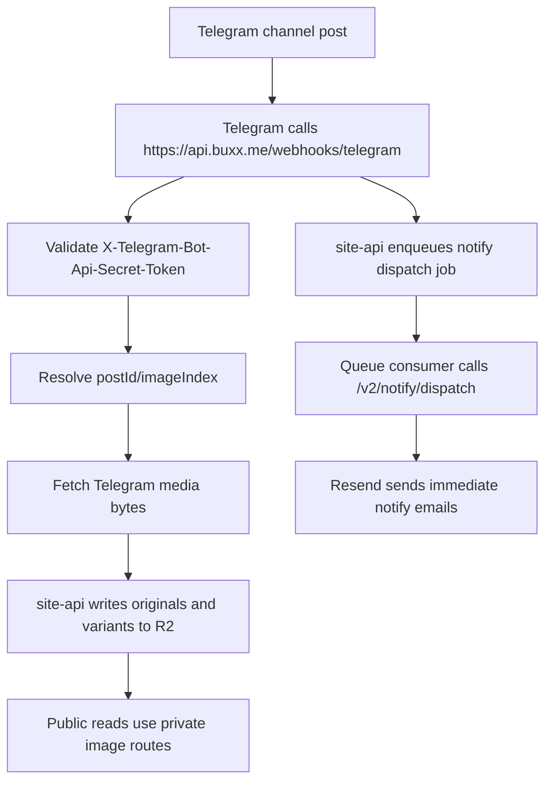

This document describes the private Telegram ingestion pipeline for mood posts, HD images, and email notifications.

## Scope

The Telegram pipeline affects:

- `POST https://api.buxx.me/webhooks/telegram`
- `https://buxx.me/api/v2/images/*`
- immediate email notify dispatch
- public mood pages that still consume Telegram content during this migration wave

## Current flow

## Who does what

| `site-api` (private) | Public `site` |
| --- | --- |
| Validate the Telegram webhook secret | Render mood feed and detail pages |
| Parse `channel_post` and resolve media-group image indexing | Consume `/api/moods` and `/api/comments` |
| Ingest mood images into R2 | Use `PUBLIC_HD_IMAGE_URL` for primary image URLs |
| Enqueue durable immediate notify dispatch jobs | Preserve the `/static/…` Telegram CDN fallback |
| Dispatch notification email through `/v2/notify/dispatch` | — |

## Key URLs

| URL | Role |
| --- | --- |
| `https://api.buxx.me/webhooks/telegram` | Webhook ingress. Private. |
| `https://buxx.me/api/v2/images/*` | Public image reads, served from R2 |
| `https://api.buxx.me/v2/notify/dispatch` | Queue consumer target for immediate notify |
| `https://buxx.me/api/*` | Routed directly to `site-api` in production |

## Failure modes

| What breaks | What happens |
| --- | --- |
| Webhook not configured | New posts never enter private ingest: R2 objects do not update and immediate notification dispatch never runs. |
| Image ingest fails | Public mood pages fall back to the stored Telegram CDN URLs when `site-api` returns them. **Email cannot fall back** — a link is fixed at delivery. |
| Notify queue handoff fails | The webhook returns a retryable failure so Telegram redelivers the update. |
