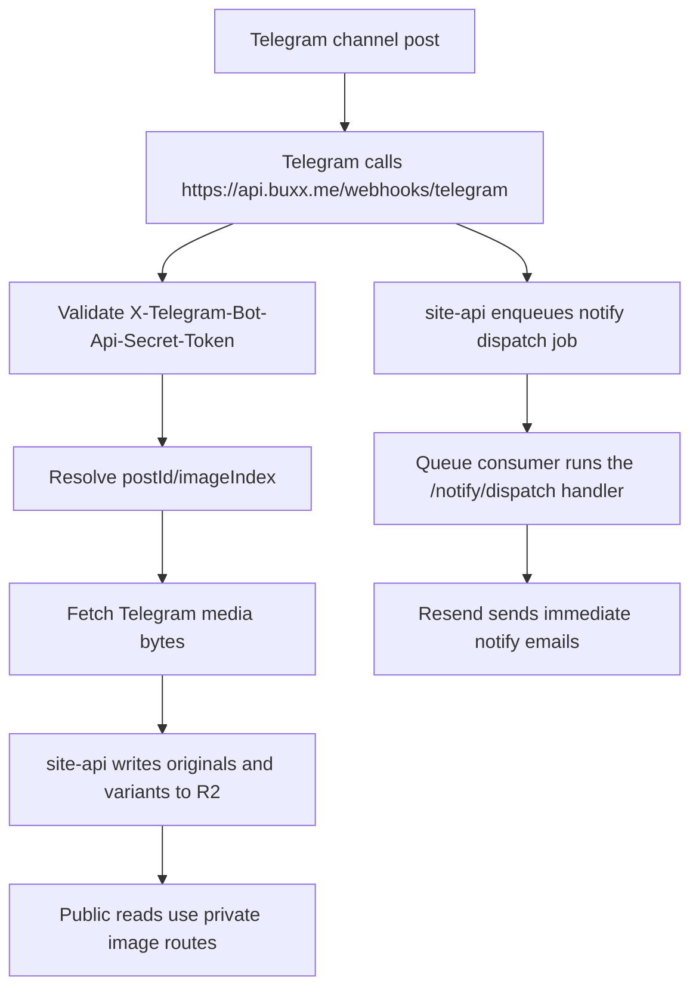
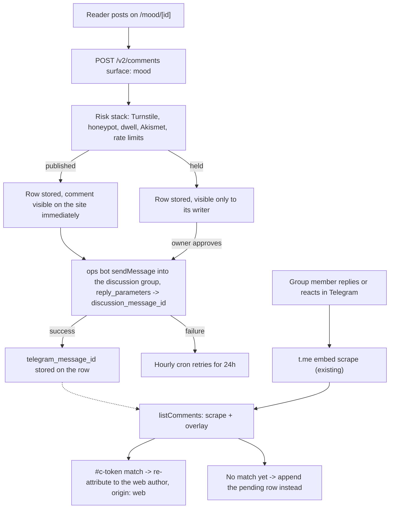

This page covers the private Telegram pipeline in `site-api`: how a channel
post becomes a mood with HD images and email notifications, and how web
comments reach the post's Telegram discussion group. Read it when you debug
ingestion, images, notify dispatch, or the comment bridge.

## Scope

The Telegram pipeline affects:

- `POST https://api.buxx.me/webhooks/telegram`
- `https://buxx.me/api/v2/images/*`
- immediate email notify dispatch
- public mood pages that still consume Telegram content during this migration wave

## Current flow

From the webhook, a new channel post takes two paths: image ingest into R2,
and a queued notify dispatch.

```mermaid
flowchart TD
  A["Telegram channel post"] --> B["Telegram calls https://api.buxx.me/webhooks/telegram"]
  B --> C["Validate X-Telegram-Bot-Api-Secret-Token"]
  C --> D["Resolve postId/imageIndex"]
  D --> E["Fetch Telegram media bytes"]
  E --> F["site-api writes originals and variants to R2"]
  F --> G["Public reads use private image routes"]
  B --> H["site-api enqueues notify dispatch job"]
  H --> I["Queue consumer runs the /notify/dispatch handler"]
  I --> J["Resend sends immediate notify emails"]
```

## The comment bridge

A second, independent flow uses the same ops bot. A web reader's mood comment
is bridged into the post's Telegram discussion group. On read, the site lays
its own copy of what it sent over the group's scrape.

`MOOD_COMMENTS_ENABLED` gates the bridge. The kill switch and the Phase 0
setup are in [Comments platform](/docs/platform/comments), and the full flow is
in [Comments API § Mood surface](/docs/api/comments#mood-surface-the-telegram-bridge).

```mermaid
flowchart TD
  A["Reader posts on /mood/[id]"] --> B["POST /v2/comments surface: mood"]
  B --> C["Risk stack: Turnstile, honeypot, dwell, Akismet, rate limits"]
  C -->|published| D["Row stored, comment visible on the site immediately"]
  D --> E["ops bot sendMessage into the discussion group, reply_parameters -> discussion_message_id"]
  E -->|success| F["telegram_message_id stored on the row"]
  E -->|failure| G["Hourly cron retries for 24h"]
  C -->|held| H["Row stored, visible only to its writer"]
  H -->|owner approves| E

  I["Group member replies or reacts in Telegram"] --> J["t.me embed scrape (existing)"]
  F -.-> K["listComments: scrape + overlay"]
  J --> K
  K --> L["#c-token match -> re-attribute to the web author, origin: web"]
  K --> M["No match yet -> append the pending row instead"]
```

### How a post finds its thread

The ops bot writes `discussion_message_id` when Telegram copies a channel post
into the linked group (`is_automatic_forward`). Usually that copy's
`forward_origin` names the channel and the post's own id, so the mapping is
exact.

A post that was itself a forward is the exception. Telegram flattens forward
chains, so the group copy's `forward_origin` describes the original author.
That author is either another channel, with its own message numbering, or a
plain user, which has no message id at all. MTProto keeps the immediate source
in `saved_from_msg_id`, but the Bot API doesn't expose it, so nothing in the
copy names the site's post.

The bot links the copy to a post like this:

| Origin chat | How the bot picks the post | Effect on `discussion_message_id` |
| --- | --- | --- |
| The site's own channel | Trusts the origin's id | Overwrites whatever the column held |
| Anything else | Matches the newest still-unlinked post published within two minutes of the copy | Only ever fills a blank |

Posts forwarded before this landed (mood 3823, 3873) have no thread. They show
the "Leave a comment on Telegram" link instead of the compose box.

## Who does what

| `site-api` (private) | Public `site` |
| --- | --- |
| Validate the Telegram webhook secret | Render mood feed and detail pages |
| Parse `channel_post` and resolve media-group image indexing | Consume `/api/moods` and `/api/comments` |
| Ingest mood images into R2 | Use `PUBLIC_HD_IMAGE_URL` for primary image URLs |
| Enqueue durable immediate notify dispatch jobs | Keep the `/static/…` Telegram CDN fallback |
| Dispatch notification email through the `/notify/dispatch` handler | |
| Run the risk stack, bridge `published` mood comments (and `held` ones once approved) into the discussion group, overlay the scrape on read | Render the mood compose box only when `discussionLinked`, POST `/v2/comments` with `surface: 'mood'` |

## Key URLs

| URL | Role |
| --- | --- |
| `https://api.buxx.me/webhooks/telegram` | Webhook ingress. Private. |
| `https://buxx.me/api/v2/images/*` | Public image reads, served from R2 |
| `https://api.buxx.me/notify/dispatch` | Immediate notify dispatch. The queue consumer runs this handler in process instead of calling the URL. `/v2/notify/dispatch` is a `308` alias. |
| `https://buxx.me/api/*` | Routed directly to `site-api` in production |

## Failure modes

| What breaks | What happens |
| --- | --- |
| Webhook not configured | New posts never enter private ingest. R2 objects don't update, and immediate notification dispatch never runs. |
| Image ingest fails | Public mood pages fall back to the stored Telegram CDN URLs when `site-api` returns them. **Email can't fall back**, because a link is fixed at delivery. |
| Notify queue handoff fails | The webhook returns a retryable failure, so Telegram redelivers the update. |
